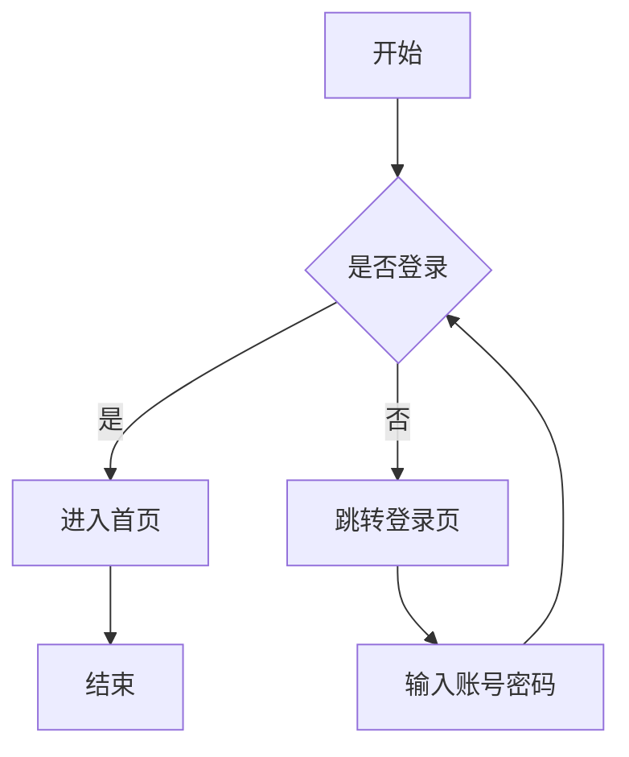

# Markdown 渲染综合测试文档（公式修正版）

这份文档基于上传的综合测试 Markdown 调整，重点修正公式定界符：行内公式使用 `\(...\)`，块级公式使用 `\[...\]`，多行公式中的换行使用 `\\`。

---

## 1. 标题层级测试

# 一级标题 H1

## 二级标题 H2

### 三级标题 H3

#### 四级标题 H4

##### 五级标题 H5

###### 六级标题 H6

---

## 2. 普通文本与强调

这是一段普通文本，用来测试 Markdown 的基础段落渲染效果。
这是同一段中的强制换行。

这是新的一段。

**这是加粗文本**

*这是斜体文本*

***这是加粗加斜体文本***

~~这是删除线文本~~

`这是行内代码`

普通文字中混合行内代码：使用 `npm install` 安装依赖，然后运行 `npm run dev` 启动项目。

---

## 3. 引用测试

> 这是一级引用。
>
> 引用中可以包含多段文字。
>
> > 这是嵌套引用。
> >
> > 嵌套引用中也可以包含 **加粗**、*斜体* 和 `代码`。

---

## 4. 列表与任务列表

* 第一项
* 第二项
  * 第二项的子项 A
  * 第二项的子项 B
    * 更深一层
    * 更深一层
* 第三项

1. 第一步：初始化项目
2. 第二步：安装依赖
3. 第三步：编写代码
   1. 编写前端页面
   2. 编写后端接口
   3. 编写测试用例
4. 第四步：部署上线

* [x] 支持标题
* [x] 支持表格
* [x] 支持代码高亮
* [x] 支持复杂数学公式
* [ ] 支持导出 PDF
* [ ] 支持自动生成目录

---

## 5. 链接、图片与分割线

这是一个普通链接：[OpenAI](https://openai.com)

这是一个带标题的链接：[GitHub](https://github.com "代码托管平台")

这是一个自动链接：[https://example.com](https://example.com)


---

---

## 6. 表格测试

| 编号 | 姓名 |  科目 | 分数 | 是否通过 |
| -: | :- | :-: | -: | :--: |
|  1 | 张三 |  数学 | 95 |   是  |
|  2 | 李四 |  英语 | 86 |   是  |
|  3 | 王五 | 计算机 | 78 |   是  |
|  4 | 赵六 |  政治 | 59 |   否  |

---

## 7. 更复杂的表格

| 模块       | 功能               |  状态 | 说明                   |
| :------- | :--------------- | :-: | :------------------- |
| Markdown | 标题、列表、引用         |  ✅  | 基础语法正常               |
| 代码块      | 多语言高亮            |  ✅  | 测试 Python、Java、C++ 等 |
| 数学公式     | 行内与块级公式          |  ✅  | 使用 LaTeX 渲染          |
| 表格       | 对齐、长文本           |  ✅  | 测试单元格换行与宽度           |
| HTML     | details、kbd、mark |  ✅  | 部分平台支持不同             |

---

## 8. 数学公式测试

行内公式测试：函数 \( f(x)=x^2+2x+1 \) 可以写成 \( f(x)=(x+1)^2 \)。

机器学习中的 \( KNN \)、\( SVM \)、\( CNN \)、\( PCA \) 都是常见算法。

时间复杂度：\( O(\log n) \)

空间复杂度：\( O(1) \)

块级公式测试：

\[
E = mc^2
\]

多行公式测试：

\[
\begin{aligned}
a^2+b^2 &= c^2 \\
x &= \frac{-b \pm \sqrt{b^2-4ac}}{2a}
\end{aligned}
\]

极限测试：

\[
\lim_{n\to\infty}\left(1+\frac{1}{n}\right)^n=e
\]

积分测试：

\[
\int_0^1 x^2\,dx=\frac{1}{3}
\]

矩阵测试：

\[
A=
\begin{bmatrix}
1 & 2 & 3 \\
4 & 5 & 6 \\
7 & 8 & 9
\end{bmatrix}
\]

分段函数测试：

\[
f(x)=
\begin{cases}
x^2, & x\ge 0 \\
-x, & x<0
\end{cases}
\]

信息熵与信息增益：

\[
\begin{aligned}
H(D) &= -\sum_{k=1}^{K} p_k\log_2 p_k \\
H(D\mid A) &= \sum_{v=1}^{V}\frac{|D_v|}{|D|}H(D_v) \\
Gain(D,A) &= H(D)-H(D\mid A)
\end{aligned}
\]

---

## 9. 脚注测试

这是一段带脚注的文字。[^note1]

这也是一个脚注示例。[^note2]

[^note1]: 这是第一个脚注内容。

[^note2]: 这是第二个脚注内容，可以包含 **加粗** 和 `代码`。

---

## 10. HTML 混合测试

<details>
<summary>点击展开详情</summary>

这里是折叠内容。

* 支持列表
* 支持 **加粗**
* 支持 `代码`

答案中的公式也应该渲染：

\[
\begin{aligned}
f(x) &= x^2 + 2x + 1 \\
&= (x+1)^2
\end{aligned}
\]

所以最小值为 \( 0 \)，此时 \( x=-1 \)。

</details>

<br>

<mark>这是高亮文本</mark>

<br>

键盘按键测试：<kbd>Ctrl</kbd> + <kbd>C</kbd>

<br>

<div align="center">

**这是一段居中的文字**

</div>

---

## 11. 代码块高亮测试：Python

```python
from dataclasses import dataclass
from typing import List


@dataclass
class Student:
    name: str
    scores: List[int]

    def average(self) -> float:
        if not self.scores:
            return 0.0
        return sum(self.scores) / len(self.scores)


students = [
    Student("Alice", [95, 88, 92]),
    Student("Bob", [76, 81, 79]),
]

for student in students:
    print(f"{student.name}: {student.average():.2f}")
```

---

## 12. 代码块高亮测试：JavaScript

```javascript
const users = [
  { id: 1, name: "Alice", active: true },
  { id: 2, name: "Bob", active: false },
  { id: 3, name: "Carol", active: true },
];

const activeUsers = users
  .filter((user) => user.active)
  .map((user) => user.name.toUpperCase());

console.log(activeUsers);
```

---

## 13. 代码块高亮测试：C++

```cpp
#include <iostream>
#include <vector>
#include <algorithm>

int main() {
    std::vector<int> nums = {5, 2, 9, 1, 7};

    std::sort(nums.begin(), nums.end());

    for (int num : nums) {
        std::cout << num << " ";
    }

    return 0;
}
```

---

## 14. 代码块高亮测试：SQL

```sql
CREATE TABLE students (
    id INTEGER PRIMARY KEY,
    name VARCHAR(100) NOT NULL,
    score INTEGER CHECK (score >= 0 AND score <= 100),
    created_at TIMESTAMP DEFAULT CURRENT_TIMESTAMP
);

INSERT INTO students (name, score)
VALUES
    ('Alice', 95),
    ('Bob', 82),
    ('Carol', 76);

SELECT
    name,
    score,
    CASE
        WHEN score >= 90 THEN '优秀'
        WHEN score >= 60 THEN '及格'
        ELSE '不及格'
    END AS level
FROM students
ORDER BY score DESC;
```

---

## 15. 代码块高亮测试：Bash、JSON、YAML

```bash
#!/usr/bin/env bash
set -e
PROJECT_NAME="markdown-test"
mkdir -p "${PROJECT_NAME}/src"
echo "# Markdown Test" > "${PROJECT_NAME}/README.md"
```

```json
{
  "name": "markdown-render-test",
  "version": "1.0.0",
  "private": true,
  "scripts": {
    "dev": "vite --host 0.0.0.0",
    "build": "vite build"
  }
}
```

```yaml
name: Markdown Render Test
on:
  push:
    branches:
      - main
jobs:
  build:
    runs-on: ubuntu-latest
```

---

## 16. Mermaid 与 Diff



```diff
function add(a, b) {
-  return a - b;
+  return a + b;
}
```

---

## 17. 嵌套 Markdown 测试

1. 第一层列表

   > 列表中的引用内容。

   ```python
   def hello():
       print("hello from nested code block")
   ```

2. 第二层列表

   | 字段         | 类型       | 说明   |
   | :--------- | :------- | :--- |
   | id         | integer  | 主键   |
   | name       | string   | 名称   |
   | created_at | datetime | 创建时间 |

3. 第三层列表

   \[
   a_n = \frac{1}{n}
   \]

---

## 18. 警告块风格测试

> [!NOTE]
> 这是 Note 提示块，部分 Markdown 渲染器支持。

> [!TIP]
> 这是 Tip 提示块，适合写技巧。

> [!IMPORTANT]
> 这是 Important 提示块。

> [!WARNING]
> 这是 Warning 警告块。

> [!CAUTION]
> 这是 Caution 注意块。

---

## 19. 小测题格式测试

### 题目 1

设函数 \( f(x)=x^2-2x+1 \)，求 \( f(x) \) 的最小值。

A. \( -1 \)  
B. \( 0 \)  
C. \( 1 \)  
D. \( 2 \)

<details>
<summary>答案与解析</summary>

正确答案：B

因为：

\[
f(x)=x^2-2x+1=(x-1)^2
\]

所以 \( f(x)\ge 0 \)，最小值为 \( 0 \)。

</details>

---

## 20. 长段落与结尾测试

这是一段较长的文字，用来观察 Markdown 渲染器在处理长文本时的行宽、换行、段落间距和字体效果。Markdown 的优势在于它足够简洁，既可以被人直接阅读，也可以被程序转换成网页、PDF、Word 或其他格式。对于学习笔记、技术文档、项目说明、算法总结和课程复习资料来说，Markdown 是一种非常适合长期维护的文本格式。

这是中文 text mixed with English words and inline code `console.log()` 的测试。

😀 😁 😂 🤖 🚀 ✅ ❌ ⚠️ 📌 📚 🧠 💻 🧪 🎯

**如果你能正常看到标题、表格、公式、代码高亮、折叠块、Mermaid 图和任务列表，说明 Markdown 渲染效果比较完整。**
