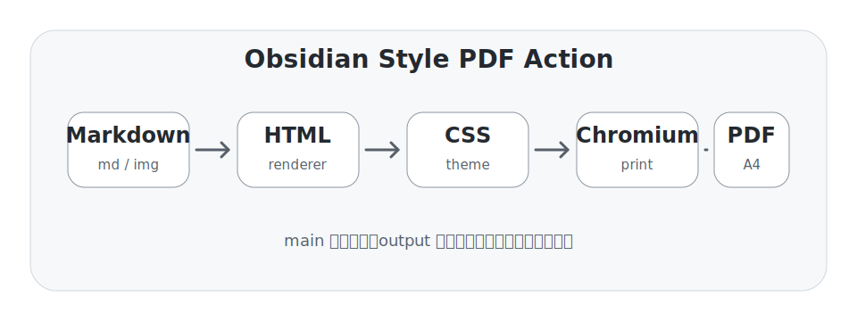

# Markdown PDF 综合渲染测试

> [!NOTE] 测试目的
> 这份文档用于系统检查 Markdown 到 PDF 的完整渲染链路：标题、段落、列表、表格、代码块、公式、图片、Obsidian 链接、HTML 片段、分页和长内容排版。

本文档刻意混合中文、English words、数字、路径、代码和公式，目标是观察生成 PDF 后是否出现标题异常、字体缺字、表格溢出、代码块过暗、公式错位、图片过宽、页脚异常或分页混乱。

---

## 1. 标题层级测试

### 1.1 三级标题

#### 1.1.1 四级标题

##### 1.1.1.1 五级标题

###### 1.1.1.1.1 六级标题

标题需要有清晰层次，但不能像网页链接一样出现明显下划线。标题之间的间距应当紧凑、稳定，适合打印复习资料。

---

## 2. 段落、强调和行内元素

这是一个普通中文段落，用来检查正文行距、字重、标点、中文换行与英文混排。PDF 中正文应该像讲义一样清楚，不应该显得过于网页化。

这是第二个段落，包含 **加粗文本**、*斜体文本*、`inline code`、==Obsidian 高亮==、普通链接 https://example.com，以及一个被转成纯文本的 Obsidian 内链：[[机器学习复习]]。

行内数学公式示例：圆的标准方程是 \( x^2 + y^2 = r^2 \)，二次函数顶点横坐标是 \( x = -\frac{b}{2a} \)，向量内积可写为 \( \boldsymbol a \cdot \boldsymbol b = \|\boldsymbol a\|\|\boldsymbol b\|\cos\theta \)。

---

## 3. 列表和任务列表

### 3.1 无序列表

- Markdown 输入
  - 支持普通段落
  - 支持公式
  - 支持图片
- HTML 中间层
  - 注入主题 CSS
  - 注入 KaTeX 样式
  - 注入代码高亮样式
- Chromium 打印
  - A4 页面
  - 页脚页码
  - 背景色正常输出

### 3.2 有序列表

1. 准备 `manifest.yml`。
2. 把 Markdown 放到 `md/`。
3. 把图片放到 `img/`。
4. 合并到 `main`。
5. 等待 Action 输出 PDF 到 `output` 分支。
6. 构建成功后自动删除 `main` 上的 `inbox` 任务。

### 3.3 任务列表

- [x] 标题渲染正常
- [x] 中文字体不缺字
- [x] 代码块可读
- [x] 公式居中且不溢出
- [ ] 手动检查最终 PDF 视觉效果

---

## 4. Callout 测试

> [!TIP] 使用建议
> 日常生成 PDF 时，推荐使用 `export/YYYY-MM-DD-topic` 临时分支提交 `inbox` 任务，合并后让 workflow 自动构建和清理。

> [!WARNING] 注意
> `main` 只应该作为构建队列，不应该长期保存每天的课程笔记、图片附件或导出的 PDF。

> [!QUESTION] 检查点
> 如果 PDF 中图片、公式或表格出问题，优先检查 Markdown 相对路径、KaTeX 写法和表格列宽。

---

## 5. 表格测试

### 5.1 普通表格

| 模块 | 输入 | 输出 | 重点检查 |
|---|---|---|---|
| Markdown | `.md` 文件 | HTML | 标题、列表、表格、代码块 |
| 样式 | `style.css` 与主题 CSS | 页面视觉 | 字体、边距、颜色、页脚 |
| 公式 | KaTeX | HTML + MathML | 行内公式和块级公式 |
| 浏览器 | Chromium | PDF | A4 页面、分页、背景 |

### 5.2 长文本表格

| 场景 | 长内容说明 | 期望效果 |
|---|---|---|
| 长中文 | 这是一段非常长的中文说明，用来测试表格单元格能否自动换行，而不是直接冲出页面右侧边界。 | 自动换行，列宽稳定。 |
| 中英混排 | Markdown renderer should handle English words, file paths like `inbox/2026/07/2026-07-02/md/001.md`, and Chinese punctuation together. | 不溢出，不重叠。 |
| 公式描述 | 行内公式 \( \mathrm{F1} = \frac{2PR}{P+R} \) 出现在表格中时，应该正常对齐。 | 公式不破坏表格高度。 |

---

## 6. 数学公式测试

### 6.1 块级公式

\[
E = mc^2
\]

\[
\int_0^1 x^2\,dx = \frac{1}{3}
\]

### 6.2 多行公式

\[
\begin{aligned}
H(D) &= -\sum_{k=1}^{K} p_k \log_2 p_k \\
H(D \mid A) &= \sum_{v=1}^{V} \frac{|D_v|}{|D|} H(D_v) \\
Gain(D,A) &= H(D) - H(D \mid A)
\end{aligned}
\]

### 6.3 矩阵公式

\[
\begin{bmatrix}
1 & 2 & 3 \\
4 & 5 & 6 \\
7 & 8 & 9
\end{bmatrix}
\begin{bmatrix}
x \\
y \\
z
\end{bmatrix}
=
\begin{bmatrix}
14 \\
32 \\
50
\end{bmatrix}
\]

### 6.4 机器学习常用指标

\[
\begin{aligned}
Precision &= \frac{TP}{TP+FP} \\
Recall &= \frac{TP}{TP+FN} \\
F_1 &= \frac{2 \cdot Precision \cdot Recall}{Precision + Recall}
\end{aligned}
\]

---

## 7. 代码块测试

### 7.1 JavaScript

```javascript
function buildOutputPath(date, filename) {
  if (!/^\d{4}-\d{2}-\d{2}$/.test(date)) {
    throw new Error('date must use YYYY-MM-DD');
  }

  const [year, month] = date.split('-');
  return `dist/queue/${year}/${month}/${date}/${filename}`;
}

console.log(buildOutputPath('2026-07-02', 'notes.pdf'));
```

### 7.2 Python

```python
from pathlib import Path

root = Path('inbox/2026/07/2026-07-02')
markdown_files = sorted((root / 'md').glob('*.md'))

for index, file in enumerate(markdown_files, start=1):
    print(f'{index:02d}: {file.name}')
```

### 7.3 SQL

```sql
SELECT date, title, status
FROM build_history
WHERE status = 'success'
ORDER BY finished_at DESC
LIMIT 10;
```

### 7.4 Shell 文本

```text
npm run validate:manifest -- inbox/2026/07/2026-07-02/manifest.yml
npm run build:day -- 2026-07-02
npm run build:queue
```

---

## 8. 图片测试

下面是本次测试附带的 SVG 图片。它用于检查相对路径、SVG 渲染、图片缩放、居中和页面边界。



图片下方继续放一段文字，检查图片之后的段落间距是否正常。如果图片高度或宽度处理不当，这里可能会出现重叠、过大的留白或分页异常。

---

## 9. HTML 片段测试

<details>
<summary>展开查看 HTML details 测试</summary>

这里是 HTML `details` 内容。PDF 打印时通常会按照当前展开状态渲染，用来检查 HTML 片段不会破坏整体排版。

</details>

<div style="border:1px solid #d0d7de; border-radius:10px; padding:12px; margin:12px 0; background:#f6f8fa;">
<strong>HTML 卡片：</strong>这是一段内嵌 HTML，用于检查 `html: true` 的 Markdown 渲染能力。
</div>

---

## 10. 分页压力测试

下面插入较长文本，观察分页时标题、段落、表格和代码块是否被不自然截断。

### 10.1 长文本段落一

机器学习复习时，很多概念不是孤立存在的。比如条件熵、信息增益、基尼指数和决策树剪枝都围绕“如何选择更好的划分”展开。PDF 讲义需要让这些层级关系清楚呈现，否则阅读时会很容易迷失。

### 10.2 长文本段落二

对于 Markdown 转 PDF 来说，真正容易出问题的地方往往不是普通段落，而是混合内容：一段文字后接公式，公式后接表格，表格中又包含行内代码或行内公式，然后再接一张宽图片。如果这些结构都能稳定渲染，日常复习资料基本就够用了。

### 10.3 长文本段落三

构建队列的设计目标是把内容投递和产物保存分开。`main` 负责接收构建任务，`output` 负责长期保存结果。这样主分支不会越来越臃肿，也更符合“项目源码”和“生成内容”分离的原则。

---

## 11. 结论检查清单

| 检查项 | 期望结果 |
|---|---|
| 标题 | 层级清楚，不像超链接 |
| 正文 | 中文清晰，行距稳定 |
| 表格 | 自动换行，不冲出页面 |
| 代码块 | 背景和高亮清楚，字体等宽 |
| 公式 | 行内和块级都正常 |
| 图片 | 不溢出页面，居中显示 |
| 页脚 | 页码正常显示 |
| 队列 | 成功后 `main` 自动删除 `inbox` |
| 产物 | PDF/HTML 保存到 `output` 分支 |
| 分支 | PR 合并后自动删除临时分支 |

> [!SUCCESS] 预期结果
> 如果这份文档能成功导出 PDF，并且 `inbox/2026/07/2026-07-02/` 被自动清理，就说明当前队列模式、产物分支和临时分支策略基本打通。
