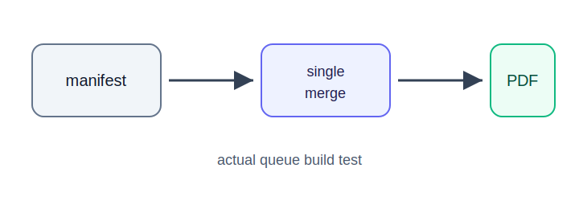

# Manifest 队列实际测试：公式与图片

这一页用于测试公式、代码块和相对图片路径。

行内公式示例：\( x^2 + y^2 = r^2 \)。

块级公式示例：

\[
\begin{aligned}
H(Y \mid X) &= \sum_x p(x) H(Y \mid X=x) \\
IG(D, A) &= H(D) - H(D \mid A)
\end{aligned}
\]

## 图片测试

下面这张 SVG 位于当天目录的 `img/` 文件夹中，Markdown 使用 `../img/queue-test.svg` 引用：



## 代码块测试

```js
const jobs = ['single', 'merge'];
console.log(`manifest jobs: ${jobs.join(', ')}`);
```
